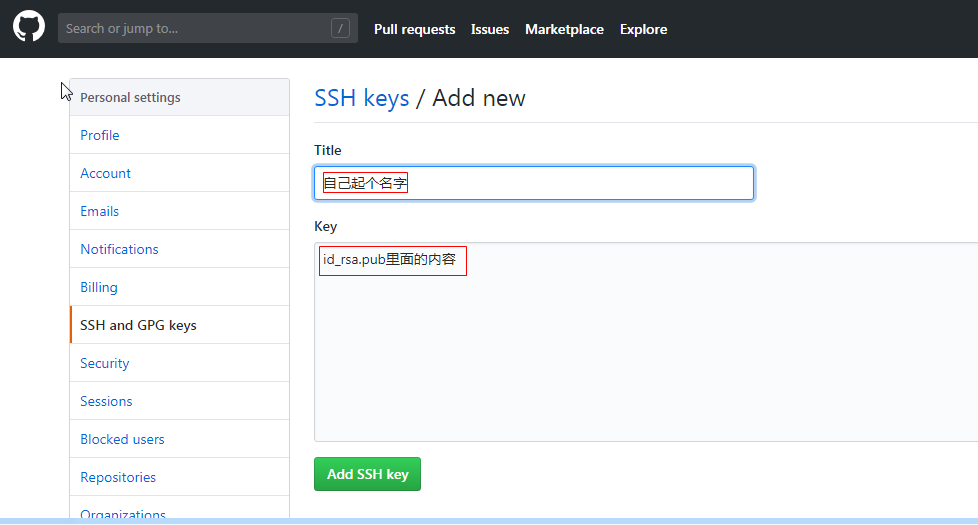
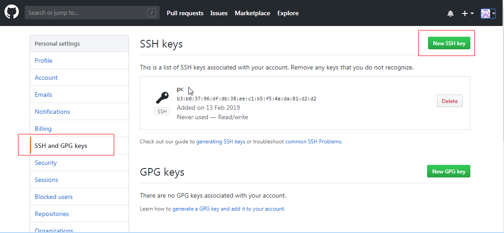

# 创建一个git仓库

```sh
git init
```

# 往仓库添加文件

```sh
git add readme.md
#或者添加git仓库文件夹底下所有文件
git add . #有个点
```

# 提交并备注一个信息（必须备注）

```sh
git commit -m "第一次提交"
```


# 添加一个新的远程仓库，可以指定一个简单的名字

```sh
git remote add shortname https://github.com/opwo/doc.git 
```


# 生成ssh

使用SSH地址如`git@github.com:opwo/doc.git`添加远程仓库。在本机生成公钥后，添加到GitHub设置里边。以后就不用了输密码了。

```sh
ssh-keygen -t rsa -C "youremail@example.com" #邮箱是注册GitHub的邮箱
```

生成后会在C盘当前用户目录下生成`.ssh`文件夹。复制`id_rsa.pub`里面的内容到github里边。





# 删除本地存储的账户密码

`控制面板`-->`用户账户`-->`凭据管理器`-->`管理Windows凭据` 找到git相关的就可以删除了