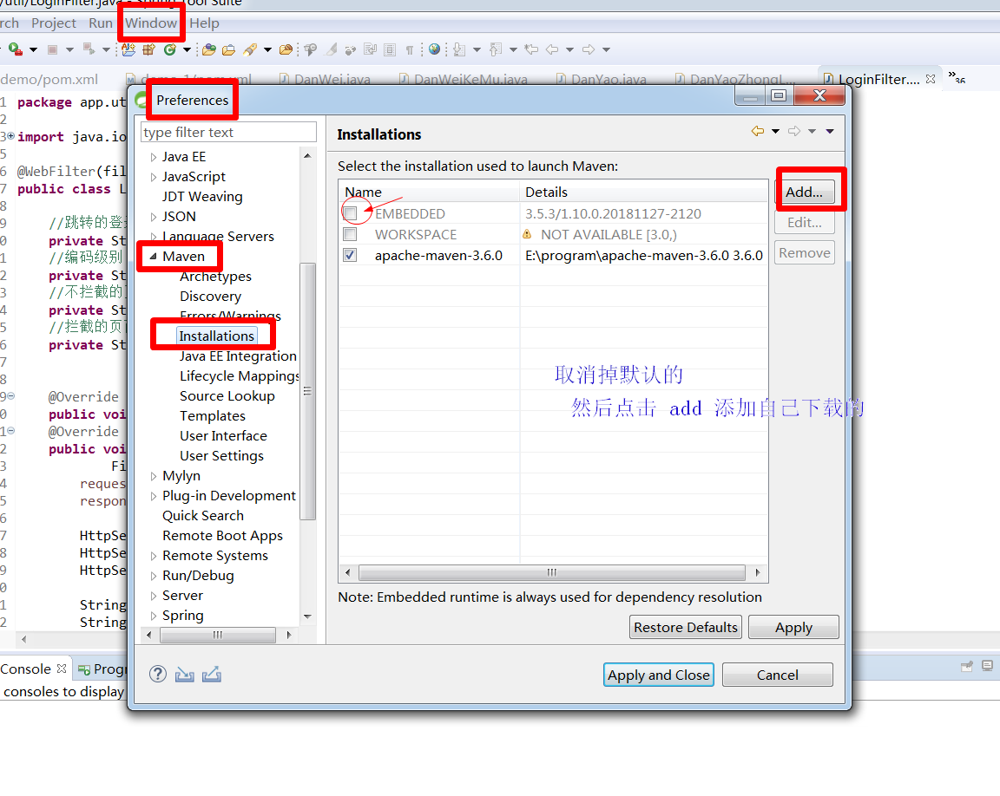
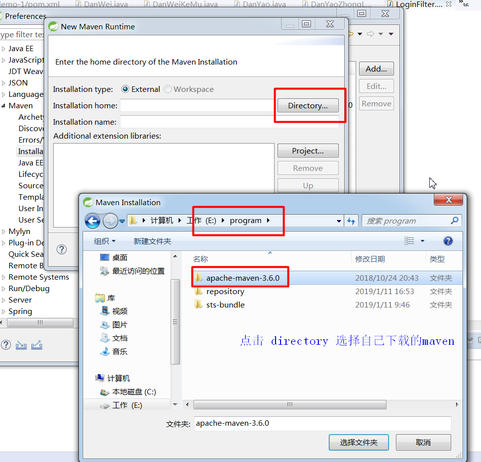
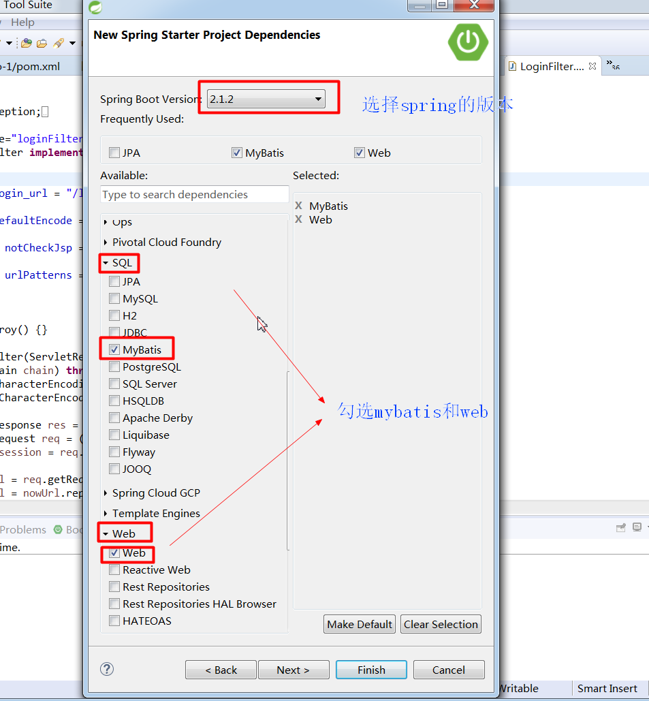
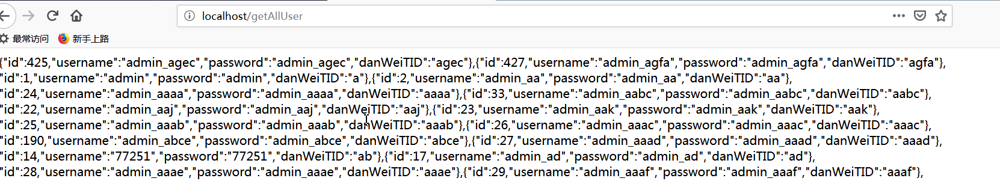

# springboot+mybatis+oracle整合
## 一. 前期准备
### 1. 开发环境
1. JDK1.8
2. 开发集成环境 Spring Tool Suite 简称**STS**，[下载地址](http://spring.io/tools)
3. apache-maven-3.6.0
 ### 2. 相关配置
#### 2.1 maven相关配置
#####2.1.1 仓库配置
打开`apache-maven-3.6.0`-->`conf`-->`settings.xml`文件
主要配置两点：**本地仓库**；**在线镜像地址**（如果不修改，默认连接境外地址，下载速度较慢。经测试连接阿里云仓库速度较快）。配置如下。
```xml
<settings xmlns="http://maven.apache.org/SETTINGS/1.0.0"
          xmlns:xsi="http://www.w3.org/2001/XMLSchema-instance"
          xsi:schemaLocation="http://maven.apache.org/SETTINGS/1.0.0 http://maven.apache.org/xsd/settings-1.0.0.xsd">  
   
<!-- 配置本地仓库地址，我是放在E盘底下，repository文件夹自己建-->
  <localRepository>E:/program/repository</localRepository>   
<mirrors> 
    <!-- 阿里镜像仓库配置-->
    <mirror>
      <id>alimaven</id>
      <name>aliyun maven</name>
  　　<url>http://maven.aliyun.com/nexus/content/groups/public/</url>
      <mirrorOf>central</mirrorOf>        
    </mirror>    
</mirrors> 
  .......
```
##### 2.1.2 STS工具中配置
1.  打开STS（ Spring Tool Suite）导航栏 `Window`-->`Preferences`-->`Maven`-->`Installations`如下图

										**图1**

										**图2**
***配置完成后就STS就使用我们自己下载的 maven*** 如**图1**所示勾选的就是我们自己下载的maven
2.  接着配置maven的配置文件`settings.xml`。让开发工具STS知道maven的具体配置，主要是我们前面配置的**本地仓库**，**在线镜像地址**。这样开发工具知道去哪个镜像下载*jar*包，然后存储到本地的什么地方。如下图所示

最后点击`Apply and Close`配置生效。

# 二. springboot+mybatis

## 1. 创建项目

打开STS `file`-->`new`-->`spring starter project`


直接`Next`



选择springboot的版本，因为我们是一个web服务所以勾选web-->web.并且勾选SQL-->mybatis。实质上就是在maven的`pom.xml`中加入需要的依赖。最后点击`finish`。

## 2. 编辑`pom.xml`导入依赖

```xml
<?xml version="1.0" encoding="UTF-8"?>
<project xmlns="http://maven.apache.org/POM/4.0.0"
	xmlns:xsi="http://www.w3.org/2001/XMLSchema-instance"
	xsi:schemaLocation="http://maven.apache.org/POM/4.0.0 http://maven.apache.org/xsd/maven-4.0.0.xsd">
	<modelVersion>4.0.0</modelVersion>
	<parent>
		<groupId>org.springframework.boot</groupId>
		<artifactId>spring-boot-starter-parent</artifactId>
		<version>2.1.1.RELEASE</version>
		<relativePath /> <!-- lookup parent from repository -->
	</parent>
	<groupId>com.example</groupId>
	<artifactId>demo-1</artifactId>
	<version>0.0.1-SNAPSHOT</version>
	<name>demo-1</name>
	<description>Demo project for Spring Boot</description>

	<properties>
		<project.build.sourceEncoding>UTF-8</project.build.sourceEncoding>
		<project.reporting.outputEncoding>UTF-8</project.reporting.outputEncoding>
		<java.version>1.8</java.version>
	</properties>

	<dependencies>
		<dependency>
			<groupId>org.springframework.boot</groupId>
			<artifactId>spring-boot-starter-data-jpa</artifactId>
		</dependency>
		<dependency>
			<groupId>org.springframework.boot</groupId>
			<artifactId>spring-boot-starter-web</artifactId>
		</dependency>
		<dependency>
			<groupId>org.mybatis.spring.boot</groupId>
			<artifactId>mybatis-spring-boot-starter</artifactId>
			<version>1.3.2</version>
		</dependency>

		<dependency>
			<groupId>org.springframework.boot</groupId>
			<artifactId>spring-boot-starter-test</artifactId>
			<scope>test</scope>
		</dependency>

		<!-- oracle -->
		<dependency>
			<groupId>com.oracle</groupId>
			<artifactId>ojdbc6</artifactId>
			<version>11.2.0.3</version>
		</dependency>
		<!-- json -->
		<dependency>
			<groupId>com.alibaba</groupId>
			<artifactId>fastjson</artifactId>
			<version>1.2.54</version>
		</dependency>
		<!--部署热启动依赖-->
        <dependency>
            <groupId>org.springframework.boot</groupId>
            <artifactId>spring-boot-devtools</artifactId>
            <optional>true</optional>
        </dependency>
	</dependencies>

	<build>
		<plugins>
			<plugin>
				<groupId>org.springframework.boot</groupId>
				<artifactId>spring-boot-maven-plugin</artifactId>
				<configuration>
					<fork>true</fork>
					<addResources>true</addResources>
				</configuration>
			</plugin>
		</plugins>
	</build>

</project>

```

## 3. `application.properties`配置数据库，端口等基本配置。

```properties
server.port=80
spring.datasource.driver-class-name=oracle.jdbc.driver.OracleDriver
spring.datasource.url=jdbc:oracle:thin:@192.168.241.129:1521:orcl
spring.datasource.username=scott
spring.datasource.password=admin
```

## 4. 以查询所有用户为例

### 4.1 目录结构如下


### 4.2启动类`StartApp.java `(默认为项目名)

StartApp.java 为默认启动程序，含`main`方法。我将默认的demo.java 修改文件名改后为StartApp.java 

```java
package app;

import org.mybatis.spring.annotation.MapperScan;
import org.springframework.boot.SpringApplication;
import org.springframework.boot.autoconfigure.SpringBootApplication;
import org.springframework.boot.web.servlet.ServletComponentScan;

@SpringBootApplication
@MapperScan(basePackages="app.mapper") //开启注解扫描，指定扫描文件为app.mapper包底下的所有包含`@mapper`的类。
@ServletComponentScan
public class StartApp {

	public static void main(String[] args) {
		SpringApplication.run(StartApp.class, args);
	}

}


```

### 4.3 `User.java`实体类 

```java
package app.entity;

import java.io.Serializable;

public class User implements Serializable{
	private int id;
	private String username;
	private String password;
	private String danWeiTID;

	@Override
	public String toString() {
		return "User [danWeiTID=" + danWeiTID + ", id=" + id + ", password="
				+ password + ", username=" + username + "]";
	}
	public int getId() {
		return id;
	}
	public void setId(int id) {
		this.id = id;
	}
	public String getUsername() {
		return username;
	}
	public void setUsername(String username) {
		this.username = username;
	}
	public String getPassword() {
		return password;
	}
	public void setPassword(String password) {
		this.password = password;
	}
	public String getDanWeiTID() {
		return danWeiTID;
	}
	public void setDanWeiTID(String danWeiTID) {
		this.danWeiTID = danWeiTID;
	}
	
}
```

### 4.4 `UserMapper.java`用户对应的mapper类

```java
package app.mapper;

import java.util.List;

import org.apache.ibatis.annotations.Mapper;
import org.apache.ibatis.annotations.Select;

import app.entity.User;

@Mapper //添加此注解，便可以被扫描到
public interface UserMapper {
	/**
	 * 返回所有用户列表
	 * @return
	 */
	@Select("SELECT * FROM ZBXL_USER")
	public List<User> findAllUser();
}

```

### 4.4 `UserController.java`控制转发器

```java
package app.controller;

import java.util.List;

import javax.servlet.http.HttpSession;

import org.springframework.beans.factory.annotation.Autowired;
import org.springframework.web.bind.annotation.RequestMapping;
import org.springframework.web.bind.annotation.RestController;

import app.entity.User;
import app.mapper.UserMapper;
import app.util.JsonUtil;
import app.util.SessionUtil;

@RestController
public class UserController {

	@Autowired
	private UserMapper userMapper;

	@RequestMapping("/getAllUser")
	public String getUsers() {
		List<User> users = userMapper.findAllUser();
		if(users != null && !users.isEmpty()) {
			return JsonUtil.toJson(users);
		}
		return "err";
	}
}

```

### 4.5 工具类`JsonUtil.java`

```java
package app.util;

import com.fasterxml.jackson.core.JsonProcessingException;
import com.fasterxml.jackson.databind.ObjectMapper;

public class JsonUtil {
	private static ObjectMapper mapper;
	public static String toJson(Object obj){
		try {
			mapper = new ObjectMapper();
			return mapper.writeValueAsString(obj);
		} catch (JsonProcessingException e) {
			e.printStackTrace();
		}
		return "json exchange fail";
	}
}

```

### 4.6 启动服务。查看效果。


打开浏览器输入`127.0.0.1/getAllUser`或者`localhost/getAllUser`。因为application.properties配置的端口是80，所以可以省略，加上像这样`127.0.0.1:80/getAllUser`也无妨。




------

指错联系：657835775@qq.com