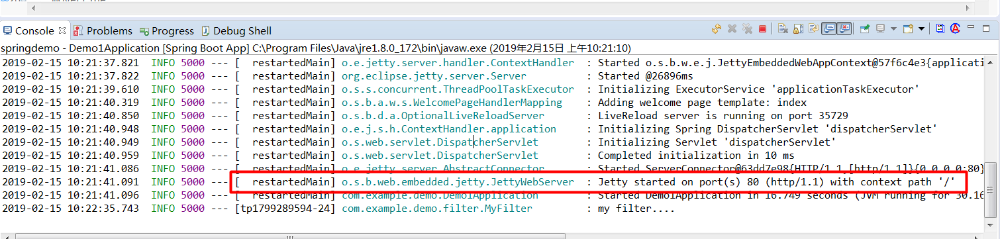

# springboot替换servlet容器jetty

## spring boot支持的嵌入式servlet容器

### 1. Tomcat(默认)

### 2. Jetty(长连接)

### 3. Undertow(高并发，不支持JSP)

## 做法

### 1.排除默认的tomcat

修改maven的`pom.xml`

```xml
<dependency>
    <groupId>org.springframework.boot</groupId>
    <artifactId>spring-boot-starter-web</artifactId>
    <!--排除tomcat-->
    <exclusions>
        <exclusion>
            <groupId>org.springframework.boot</groupId>
            <artifactId>spring-boot-starter-tomcat</artifactId>
        </exclusion>
    </exclusions>
</dependency>
```
### 2.pom添加jett依赖

```xml
<!-- 添加jetty -->
<dependency>
    <groupId>org.springframework.boot</groupId>
    <artifactId>spring-boot-starter-jetty</artifactId>
</dependency>
```

启动springboot项目浏览器输入servlet请求地址测试结果。



可以看到jetty已经启动。成功更换。

**改成undertow一样。修改pom文件**

```xml
<dependency>
    <groupId>org.springframework.boot</groupId>
    <artifactId>spring-boot-starter-web</artifactId>
    <exclusions>
        <exclusion>
            <groupId>org.springframework.boot</groupId>
            <artifactId>spring-boot-starter-tomcat</artifactId>
        </exclusion>
    </exclusions>
</dependency>
<!-- 添加undertow-->
<dependency>
    <groupId>org.springframework.boot</groupId>
    <artifactId>spring-boot-starter-undertow</artifactId>
</dependency>
```

